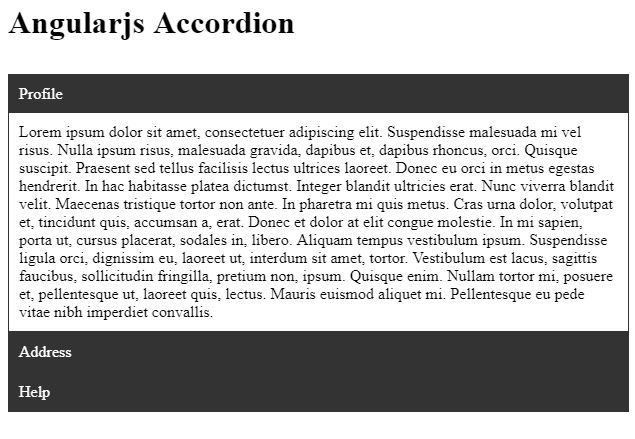

# Accordion-Directive-AngularJs
This is a simple module for building a Accordion directive using Angular JS.

# Why Accordion-Directive?
I have created custom accordion using angularjs.I need to have more control over when the accordions open and close. Also we can avoid using other plugins.

    

